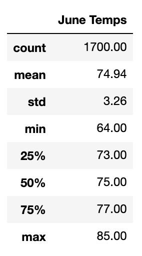
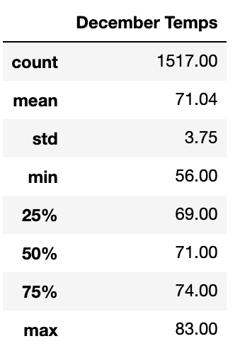
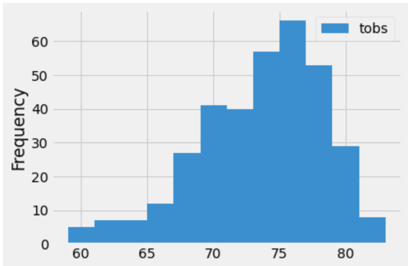
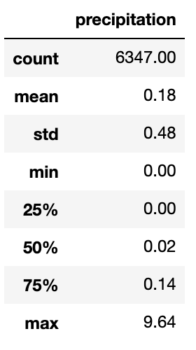

# Surf's Up
Weather analysis with Python, SQLite, SQLAlchemy, and Flask

## Overview
The purpose of this analysis was to examine weather trends (precipitation, temperature) in "June and December in Oahu, in order to determine if the surf and ice cream shop business is sustainable year-round." In order to do that we:
- accessed meteorological data in an SQLite file;
- wrote queries to examine temperature data collected in the months of June and December;
- calculated summary statistics (especially min, max, and average temperatures collected).

## Results
The data collected presented a pretty ideal location for a year-round surf-and-ice cream business.

- Summer and winter average temps differ by less than 4 degrees. This shows that the year-round weather isn't highly variable, and it's rarely too cold for a scoop of mint-chocolate chip and some tight curls.

- Most temperature observations ranged within about 4 degrees on either side of this average. This says that the majority days are within close range of the average, and that the average temp isn't rare weather. Not only are you unlikely to encounter freezing waves, but your double-scoop cone of rocky road is also unlikely to melt before you can eat it.

- Less than 3/4 of daily rainfall measurements, over a three year period, show less than 0.14 inches. This data, modified from work done in the module, shows that average rainfall is fairly light. This means that you don't have to worry about bad weather at the beach or your triple-scoop sundae having an unwanted topping of rain drops.

## Summary
In short, Oahu is a great place to invest in a surf-and-ice cream shop. Why didn't I think of this? The weather is pleasant and moderate year-round. The lows are rarely too low and the highs are rarely too high. And while it may occasionally experience torrential downpours, most days are clear.

If one wanted to expand this analysis with more data, I would suggest collecting:
- average hours of sunshine per day;
- average wind speeds on the coast.
These measurements would help determine quality of surfing and how many optimal hours of operation the shop could have.

